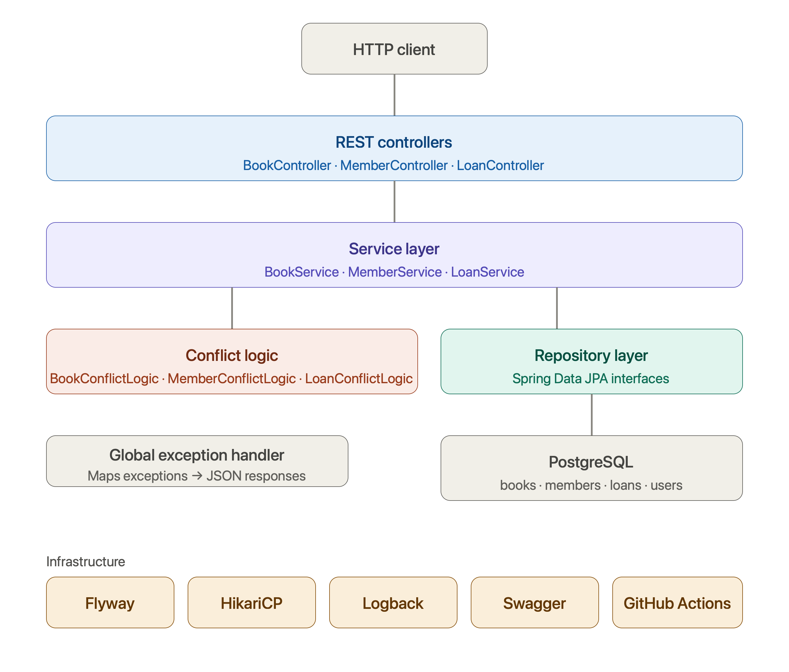

# Library Management System

A backend REST API built with Java and Spring Boot. The purpose of this project was not to implement complex business logic, but to build something from scratch and progressively apply real-world backend technologies — understanding how each layer works and how everything fits together. The business logic is intentionally minimal; the focus was on the engineering.

**Live API:** https://library-management-system-production-b765.up.railway.app  
**API Documentation (Swagger):** https://library-management-system-production-b765.up.railway.app/swagger-ui/index.html

---

## What the Application Does

A library management system that handles books, members, and loans. Core functionality includes:

- Adding, updating, activating and deactivating books
- Registering and managing library members
- Creating loans (borrowing books), returning books, and tracking overdue status
- Searching books by title or author
- Viewing active, returned, and overdue loans

The overdue status is derived at read time based on the loan's due date — it is never stored in the database, which keeps the data consistent without requiring scheduled jobs.

---

## Technology Stack

| Technology | Purpose |
|---|---|
| Java 17 | Core language |
| Spring Boot 3.2.5 | Application framework and auto-configuration |
| Spring Data JPA + Hibernate | ORM and database interaction |
| Spring Web (REST) | REST controller layer |
| Spring Validation (Jakarta) | Request body validation |
| PostgreSQL 16 | Relational database |
| HikariCP | Database connection pooling |
| Flyway | Database schema versioning and migrations |
| SLF4J + Logback | Structured logging with rolling file appenders |
| Swagger / SpringDoc OpenAPI | Interactive API documentation |
| JUnit 5 + Mockito | Unit testing |
| Docker + Docker Compose | Containerized deployment |
| GitHub Actions | CI pipeline — automated build and test on every push |
| Railway | Cloud deployment |

---

## Project Evolution

This project was built incrementally across six branches, each adding a new layer of production readiness. Every branch is preserved and tagged in the repository.

### v1.0 — File Storage
The first working version. Books, members, and loans stored in JSON files. Spring Core used for dependency injection. Basic CLI interface.

### v2.0 — JDBC + Production Hardening
Replaced file storage with raw JDBC and PostgreSQL. Added HikariCP connection pooling, SLF4J/Logback logging with rolling file appenders, Spring `@Transactional` for data integrity, and environment variable-based configuration for credentials.

### v3.0 — Spring Boot REST API
Migrated from Spring Core to Spring Boot. Replaced the CLI with REST controllers. Added global exception handling with meaningful HTTP status codes, Swagger/OpenAPI documentation, and Jakarta Bean Validation on request DTOs.

### v4.0 — Spring Data JPA + Flyway
Replaced raw JDBC repositories with Spring Data JPA interfaces. Converted entities with JPA annotations and `@ManyToOne` relationships. Added Flyway for version-controlled schema migrations and seed data. Extracted conflict logic into dedicated components.

### v5.0 — CI/CD Pipeline
Added GitHub Actions workflow that automatically builds the project and runs all unit tests on every push. PostgreSQL is spun up as a service container during the pipeline run.

### v5.1 — Docker Compose
Added `Dockerfile` with multi-stage build and `docker-compose.yml` for one-command local deployment. App and database run in isolated containers on a shared Docker network.

---

## Running Locally

### Prerequisites
- Docker Desktop installed — nothing else required

### Steps

```bash
git clone https://github.com/ShokhrukhE/library-management-system.git
cd library-management-system
docker-compose up --build
```

That's it. Docker will:
1. Pull PostgreSQL 16
2. Build the Spring Boot application
3. Run Flyway migrations and seed data automatically
4. Start the API on port 8080

**API base URL:** `http://localhost:8080`  
**Swagger UI:** `http://localhost:8080/swagger-ui/index.html`

To stop:
```bash
docker-compose down
```

To stop and remove all data:
```bash
docker-compose down -v
```

---

## API Overview

Full interactive documentation is available via Swagger at the links above. A summary of available endpoints:

### Books
| Method | Endpoint | Description |
|---|---|---|
| GET | `/api/books` | Get all active books |
| GET | `/api/books/{id}` | Get book by ID |
| GET | `/api/books/title/{title}` | Search by title |
| GET | `/api/books/author/{author}` | Search by author |
| GET | `/api/books/inactive` | Get all inactive books |
| POST | `/api/books` | Add a new book |
| PUT | `/api/books/{id}` | Update book copies |
| DELETE | `/api/books/{id}` | Deactivate a book |
| PATCH | `/api/books/{id}/activate` | Activate a book |

### Members
| Method | Endpoint | Description |
|---|---|---|
| GET | `/api/members` | Get all active members |
| GET | `/api/members/{id}` | Get member by ID |
| POST | `/api/members` | Register a new member |
| PUT | `/api/members/{id}` | Update member details |
| DELETE | `/api/members/{id}` | Deactivate a member |
| PATCH | `/api/members/{id}/activate` | Activate a member |

### Loans
| Method | Endpoint | Description |
|---|---|---|
| GET | `/api/loans` | Get all loans |
| GET | `/api/loans/{id}` | Get loan by ID |
| GET | `/api/loans/active` | Get active loans |
| GET | `/api/loans/overdue` | Get overdue loans |
| GET | `/api/loans/returned` | Get returned loans |
| POST | `/api/loans` | Create a loan |
| PATCH | `/api/loans/{id}/return` | Return a book |

---

## Architecture

```
Controller → Service → Repository → Database
```

- **Controller** — handles HTTP requests and responses, no business logic
- **Service** — business rules, validation, orchestration
- **Conflict Logic** — extracted business rule checks (active/inactive, availability, duplicates)
- **Repository** — Spring Data JPA interfaces, database access only
- **Global Exception Handler** — maps all exceptions to consistent JSON error responses
- **Flyway** — owns the schema, Hibernate only validates



---

## Testing

Unit tests written with JUnit 5 and Mockito covering service layer logic, conflict logic components, and validators. Tests are run automatically via GitHub Actions on every push.

```bash
mvn test
```

---

## Future Improvements

- **Spring Security + JWT** — role-based authentication (ADMIN / USER). Intentionally deferred to implement properly after completing Spring Security in Action by Laurentiu Spilca.
- **Testcontainers** — integration tests with a real PostgreSQL instance spun up during test runs
- **Refresh tokens** — short-lived access tokens with refresh token rotation
- **Pagination** — paginated responses for list endpoints
- **Book ratings and comments** — members can rate and review books
- **Member reward system** — track consistent borrowing behavior and reward active members
- **Admin endpoint for role management** — promote users to ADMIN via API

---

## Author

**Shokhrukh Ernazarov**  
[LinkedIn](https://www.linkedin.com/in/shokhrukh-ernazarov-5b73752b9/)
